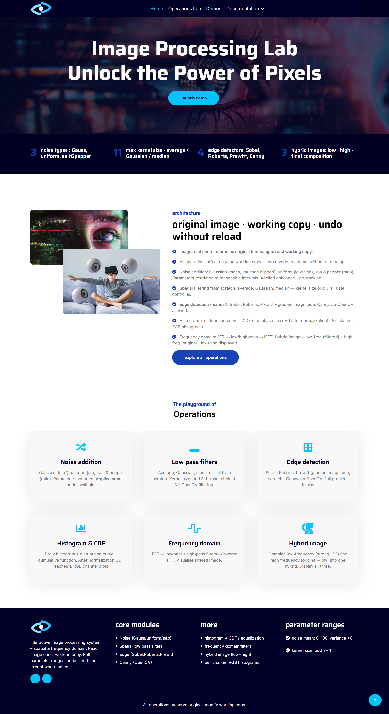
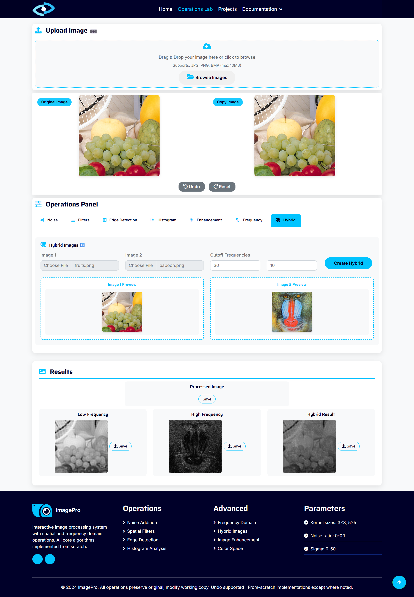
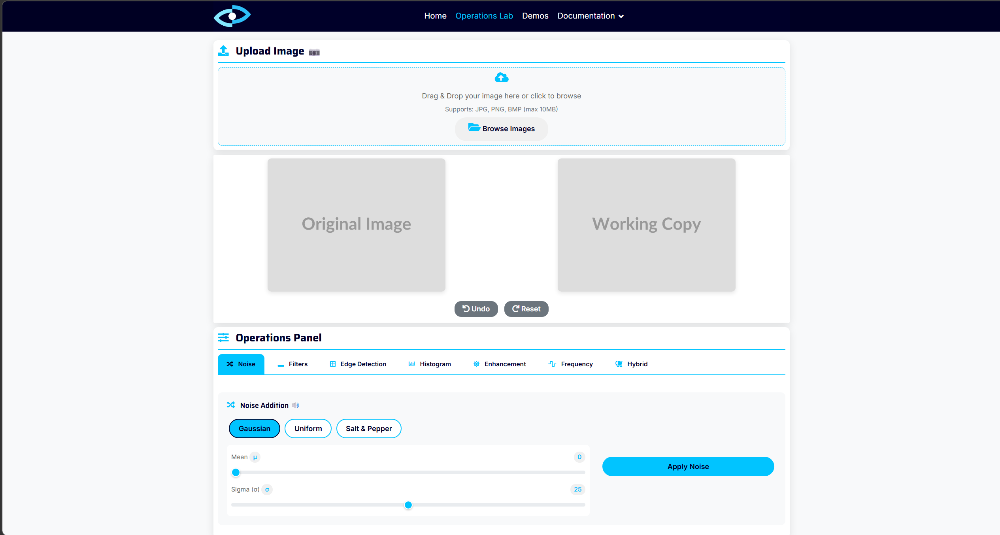
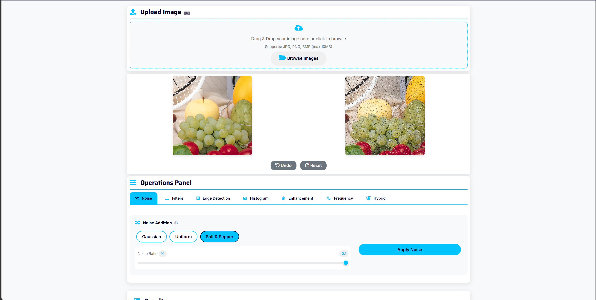
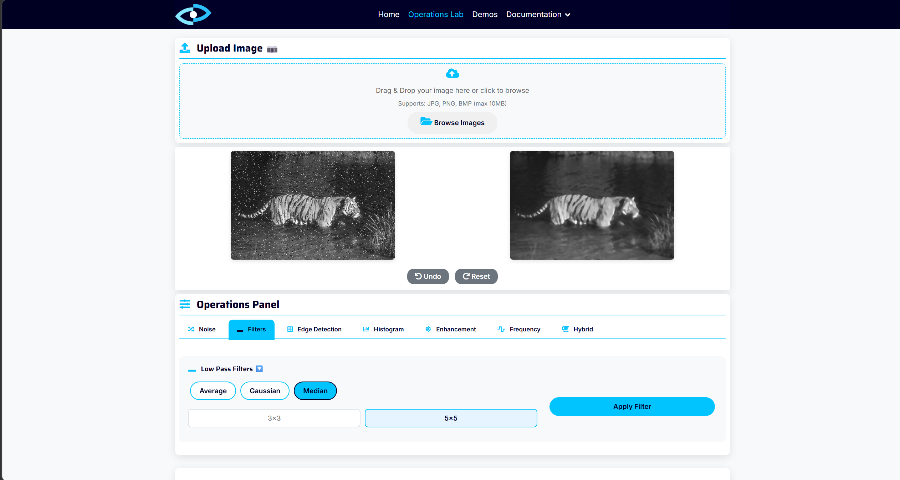
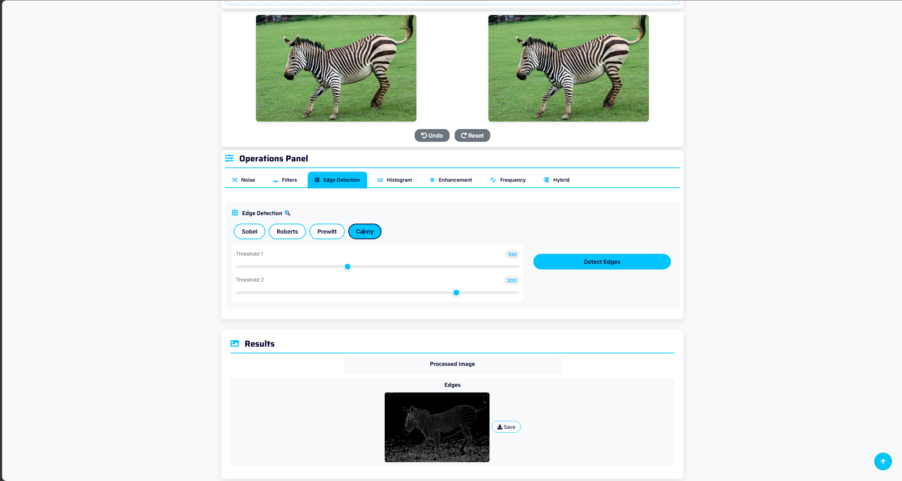
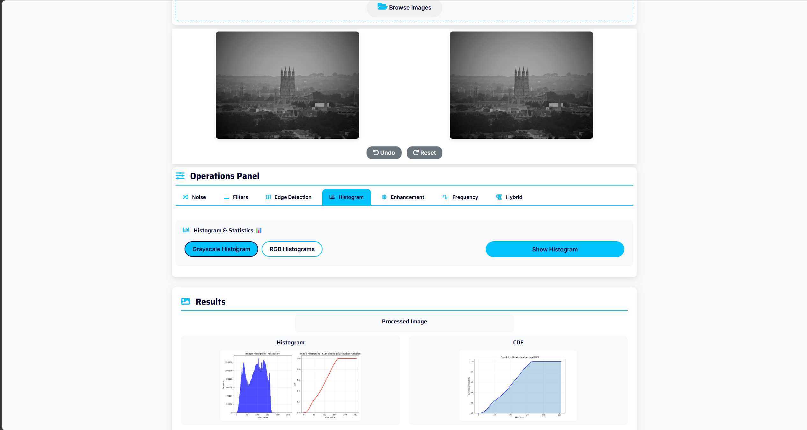
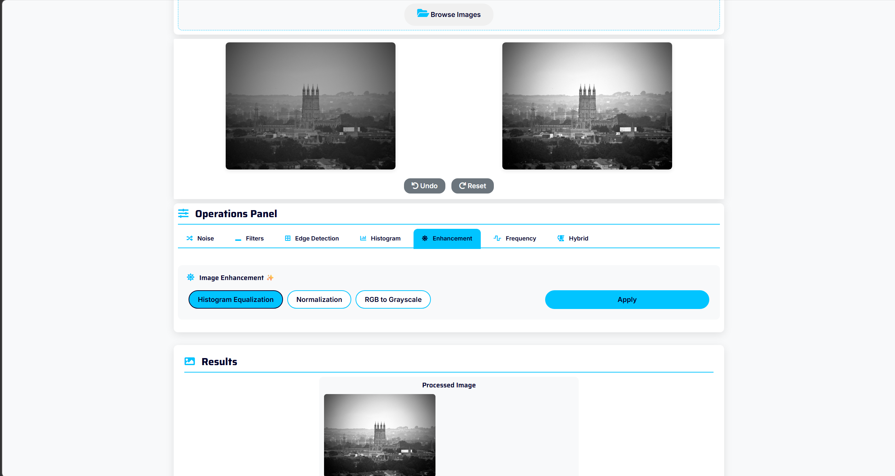
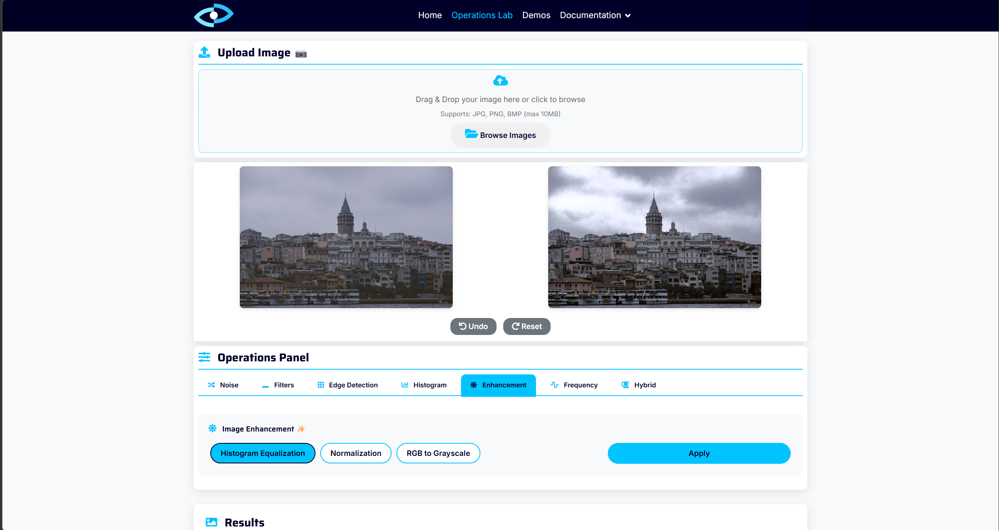
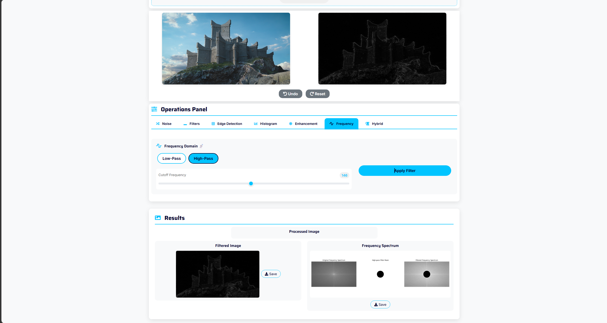

<div align="center">

#  ImagePro

### Real-Time Image Processing Web Application

[](https://python.org)
[](https://fastapi.tiangolo.com)
[](https://opencv.org)
[](https://developer.mozilla.org/en-US/docs/Web/JavaScript)
[](https://numpy.org)
[](https://scipy.org)

---

**ImagePro** is a full-stack, interactive web application that brings core computer vision algorithms to life. Built with a **FastAPI** backend and a **vanilla JavaScript** frontend, it lets users upload images, apply a wide range of processing operations in real time, and instantly visualize the results — all through a polished, modern UI.

What makes this project unique is that **nearly every algorithm is implemented from scratch** using raw NumPy and SciPy operations — no black-box OpenCV calls for the core processing. This makes the codebase an excellent learning resource for anyone studying computer vision fundamentals.

[Getting Started](#-quick-start) · [ Features](#-features--demos) · [ API Reference](#-api-endpoints) · [ Project Structure](#-project-structure)

</div>

---

##  Application Preview

### Home Page

The landing page features a modern, responsive design with animated sections, a feature overview, and a team carousel. It introduces users to the application and its capabilities before they dive into the processing workspace.

<p align="center">
  
</p>

---

###  Operations Workspace

The operations page is the heart of the application — a split-panel workspace where the **original image** and the **processed result** are displayed side by side. A tabbed control panel on the left lets users switch between operation categories, adjust parameters through sliders and dropdowns, and apply transformations with a single click. Every operation supports **undo** and **reset**, so users can freely experiment without losing their original image.

<p align="center">
  
</p>

<p align="center">
  
</p>

---

##  Features & Demos

ImagePro covers the full spectrum of classical image processing, organized into seven operation categories. Each section below explains **what the operation does**, **why it's useful**, and **how it's implemented** under the hood.

---

###  1. Noise Generation

> **What it does:** Artificially degrades an image by injecting random disturbances into pixel values.

Noise simulation is a fundamental step in computer vision research — you need noisy images to develop and test denoising algorithms. ImagePro supports three noise models:

| Noise Type         | Description                                                                                                          |
| ------------------ | -------------------------------------------------------------------------------------------------------------------- |
| **Gaussian**       | Adds random values drawn from a normal (bell-curve) distribution. Controlled by `mean` and `sigma` (spread). Simulates sensor noise in cameras. |
| **Uniform**        | Adds random values where every value in a range is equally likely. Produces a more "flat" distortion compared to Gaussian. |
| **Salt & Pepper**  | Randomly flips pixels to pure **white (255)** or pure **black (0)**. Simulates transmission errors or dead pixels. Controlled by a `ratio` parameter. |

All three noise functions are **implemented from scratch** using `numpy.random`.

<p align="center">
  
</p>

<p align="center"><em>Salt & Pepper noise applied to a test image — white and black pixels are randomly scattered across the image.</em></p>

---

###  2. Spatial Filters

> **What it does:** Smooths, blurs, or denoises images by sliding a small window (kernel) across every pixel and computing a new value from its neighbors.

Spatial filtering is the backbone of image preprocessing. ImagePro implements **manual 2D convolution from scratch** — no `cv2.filter2D` calls. The custom `convolve2d_manual()` function handles zero-padding, kernel sliding, and multi-channel (RGB) processing.

| Filter Type    | Kernel Strategy                                                                                                    | Best For                        |
| -------------- | ------------------------------------------------------------------------------------------------------------------ | ------------------------------- |
| **Average**    | All kernel weights are equal (e.g., each = 1/9 for a 3×3 kernel). Each pixel becomes the mean of its neighbors.    | General smoothing               |
| **Gaussian**   | Kernel weights follow a bell curve — center pixels contribute more, edges contribute less. Controlled by `sigma`.   | Noise reduction while preserving edges |
| **Median**     | Sorts all neighbor values and picks the middle one. A **non-linear** filter (no multiplication/summation).           | Removing salt & pepper noise    |

Users can adjust the **kernel size** (3×3, 5×5, 7×7, etc.) to control filter strength.

<p align="center">
  
</p>

<p align="center"><em>Median filter effectively removes salt & pepper noise while keeping edges sharp — the gold standard for impulse noise removal.</em></p>

---

###  3. Edge Detection

> **What it does:** Identifies boundaries in images where brightness changes rapidly — revealing the outlines and structure of objects.

Edge detection is arguably the most visually striking operation in computer vision. ImagePro implements **four different edge detection algorithms**, three of which are built entirely from scratch:

| Algorithm    | Kernel Size | Implementation | Description                                                                                      |
| ------------ | ----------- | -------------- | ------------------------------------------------------------------------------------------------ |
| **Sobel**    | 3×3         | From scratch   | Uses weighted horizontal/vertical kernels. The center row/column gets double weight, making it more robust to noise than Prewitt. Returns magnitude + X/Y gradient maps. |
| **Roberts**  | 2×2         | From scratch   | Uses the smallest possible kernels to detect edges along **diagonal** directions. Fastest but most noise-sensitive. |
| **Prewitt**  | 3×3         | From scratch   | Similar to Sobel but with **equal weights** — no center emphasis. Good baseline comparison.        |
| **Canny**    | —           | OpenCV         | A multi-stage pipeline: Gaussian blur → gradient computation → non-maximum suppression → double thresholding → hysteresis tracking. Produces clean, 1-pixel-wide edges. Controlled by two threshold parameters. |

For Sobel, Roberts, and Prewitt, the app returns **three images**: the combined edge magnitude, the horizontal gradient (grad_x), and the vertical gradient (grad_y), giving users full visibility into how direction-specific edge responses combine.

<p align="center">
  
</p>

<p align="center"><em>Canny edge detection — produces clean, thin edges with adjustable sensitivity via the two threshold sliders.</em></p>

---

###  4. Histogram Analysis & Visualization

> **What it does:** Computes and displays the distribution of pixel intensities in an image — a fundamental tool for understanding image exposure, contrast, and color balance.

A histogram is essentially a bar chart showing **how many pixels have each brightness level** (0 = black, 255 = white). ImagePro provides two histogram modes:

| Mode          | What It Shows                                                                                                     |
| ------------- | ----------------------------------------------------------------------------------------------------------------- |
| **Grayscale** | Single histogram of luminance values + the **Cumulative Distribution Function (CDF)** curve, which shows the running percentage of pixels at or below each intensity level. |
| **RGB**       | Four-panel display: individual histograms for each color channel (**Red**, **Green**, **Blue**) + a combined overlay showing all three channels on one axis. |

Both the histogram computation and the CDF calculation are **implemented from scratch** using NumPy. The visualizations are rendered with Matplotlib and sent to the frontend as base64-encoded images.

<p align="center">
  
</p>

<p align="center"><em>Grayscale histogram — the bar chart reveals the intensity distribution, while the CDF curve shows cumulative pixel density.</em></p>

<p align="center">
  
</p>

<p align="center"><em>After histogram equalization — the distribution is spread more evenly across the full 0–255 range, producing improved contrast.</em></p>

<p align="center">
  
</p>

<p align="center"><em>RGB histogram equalization — each color channel's distribution is visualized independently after enhancement.</em></p>

---

###  5. Image Enhancement

> **What it does:** Improves the visual quality and contrast of images through pixel-value transformations.

| Technique              | Description                                                                                                               |
| ---------------------- | ------------------------------------------------------------------------------------------------------------------------- |
| **Histogram Equalization** | Redistributes pixel intensities so that the histogram becomes approximately uniform. Dark images become brighter, washed-out images gain contrast. For color images, only the luminance (Y) channel in YUV space is equalized, preserving original colors. |
| **Normalization**      | Linearly scales all pixel values to fill a target range (0–1 or 0–255). If the darkest pixel is 50 and the brightest is 200, normalization stretches them to span the full range. Supports two output range modes. |
| **Grayscale Conversion** | Converts color images to grayscale using the perceptual luminance formula: `0.299·R + 0.587·G + 0.114·B`. The weights reflect human eye sensitivity — we perceive green as brightest, then red, then blue. |

---

### 6. Frequency Domain Filtering

> **What it does:** Transforms the image into the frequency domain using the **Fast Fourier Transform (FFT)**, applies a circular filter mask, and converts back — enabling powerful global operations that are difficult to achieve in the spatial domain.

Every image is a mix of **low frequencies** (smooth gradients, large shapes) and **high frequencies** (sharp edges, fine textures, noise). The FFT lets us separate and manipulate these components independently.

| Filter Type   | What It Keeps              | Visual Effect                              | Use Case                        |
| ------------- | -------------------------- | ------------------------------------------ | ------------------------------- |
| **Low-pass**  | Frequencies below `cutoff` | Image becomes **blurry** — edges disappear | Noise reduction, smoothing      |
| **High-pass** | Frequencies above `cutoff` | Only **edges and textures** remain         | Edge enhancement, sharpening    |

The `cutoff` slider controls the radius of the circular mask — a smaller radius means more aggressive filtering. The app also generates a **3-panel frequency visualization** showing the original spectrum, the applied mask, and the filtered spectrum.

<p align="center">
  
</p>

<p align="center"><em>Frequency domain filtering — the spectrum visualization (bottom) shows the original FFT magnitude, the circular filter mask, and the resulting filtered spectrum.</em></p>

---

###  7. Hybrid Image Creation

> **What it does:** Combines the **low-frequency content** of one image with the **high-frequency content** of another to create a single image that looks different depending on viewing distance.

This is one of the most fascinating operations in the app. Hybrid images exploit how human vision works:

- **Up close**, our eyes resolve fine details (high frequencies) — so you see image #2
- **From far away**, our eyes only perceive broad shapes (low frequencies) — so you see image #1

The implementation extracts low frequencies from image 1 and high frequencies from image 2 using FFT, then blends them with `cv2.addWeighted()`. Two separate `cutoff` sliders let users independently control how much of each image contributes.

---


**Key design decisions:**

- **Session-based state management** — Each upload creates a unique `session_id`. The server stores the original image, the current working image, and a full operation history in memory, enabling undo/reset without re-uploading.
- **Base64 image transport** — Processed images are encoded as base64 strings and sent as JSON responses, eliminating the need for file serving or temporary storage on disk.
- **Modular operations** — Each algorithm category lives in its own file under `operations/`, making it easy to add new operations or modify existing ones without touching the main server code.

---


## Quick Start
### 1️⃣ Clone the Repository

```bash
git clone https://github.com/your-username/Computer_vision_task1.git
cd Computer_vision_task1
```

### 2️⃣ Create & Activate a Virtual Environment

```bash
# Create the environment
python -m venv venv

# Activate — Windows
venv\Scripts\activate

# Activate — macOS / Linux
source venv/bin/activate
```

### 3️⃣ Install Dependencies

```bash
pip install -r requirements.txt
```

<details>
<summary> <strong>Full dependency list</strong></summary>

| Package            | Purpose                                      |
| ------------------ | -------------------------------------------- |
| `fastapi`          | Web framework for building the REST API      |
| `uvicorn`          | ASGI server to run the FastAPI application   |
| `opencv-python`    | Computer vision utilities (Canny, color space conversions) |
| `numpy`            | Array math and algorithm implementations     |
| `scipy`            | FFT for frequency domain operations          |
| `pillow`           | Image I/O utilities                          |
| `python-multipart` | Parsing multipart form uploads               |

</details>

### 4️⃣ Start the Server

```bash
cd Backend
uvicorn main:app --reload
```

You should see:

```
INFO:     Uvicorn running on http://127.0.0.1:8000 (Press CTRL+C to quit)
INFO:     Started reloader process
```

### 5️⃣ Open the Application

Navigate to **http://127.0.0.1:8000** in your browser — you're ready to go!

> ** Tip:** The `--reload` flag enables hot-reloading — the server automatically restarts when you modify any Python file, making development seamless.

---

##  Usage Guide

1. **Open** the application in your browser and navigate to the **Operations** page
2. **Upload** an image — drag and drop it onto the upload area, or click to browse
3. **Choose** an operation category from the tabs (Noise, Filters, Edge Detection, etc.)
4. **Select** the specific algorithm and adjust parameters using the sliders
5. **Apply** — click the apply button and watch the result appear instantly
6. **Compare** — the original and processed images are displayed side by side
7. **Chain** operations — apply multiple operations sequentially to build complex pipelines
8. **Undo** the last operation or **Reset** to the original image at any time

---

##  Contributors

This project was developed as part of a **Computer Vision** university course assignment, demonstrating practical implementation of classical image processing algorithms with a modern web interface.

---

<div align="center">

**⭐ Star this repository if you found it helpful!**

</div>
